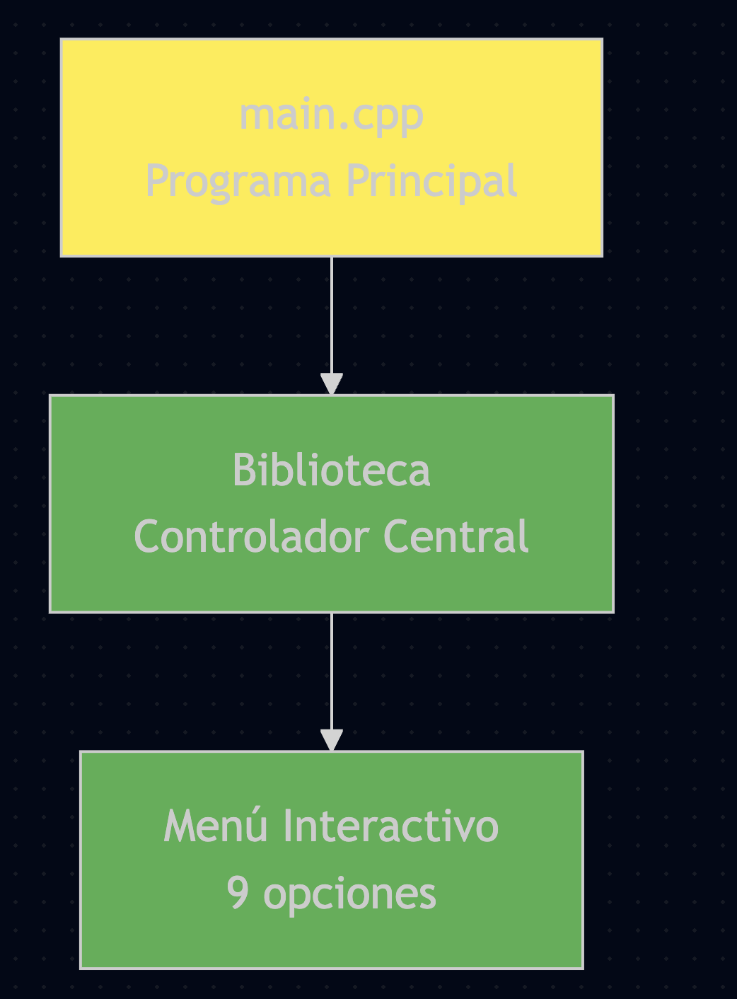
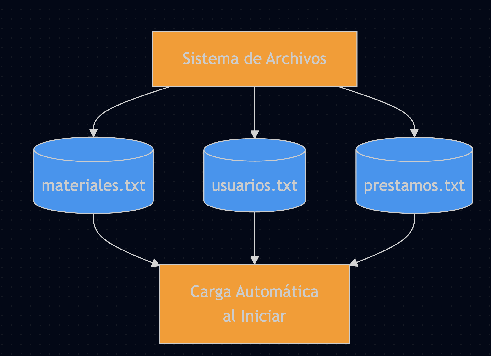

# Mi biblioteca

Proyecto Final para el curso de Fundamentos de Programación con C++.

Uso del proyecto: <https://youtu.be/m3yliW7Dmco>

## Diagramas

Diagramas útiles para explicar

### Clases


### Flujo en archivos



### Persistencia de datos



### Operaciones


## Como ejecutar

1. hacemos make ( compila todo)

```sh
make
```

Otra alternativa:

```sh
make run
```

Este comando se asegura que tengamos los materiales para persistencia:

```sh
make setup-data
```

Es como un seeder en una base de datos con datos de ejemplo.

Esto compila y ejecuta el programa.

El delegado dijo que espere a que actualice el repositorio y que me saldrían las
instrucciones del repositorio, pero ya pasaron algunos días y todavía no sale.
cppcheck lo podemos instalar en mac usando brew:

Voy a copiar las instrucciones que enviaron al grupo y desarrollarlo aquí para
ir avanzando.

## Estructura del Proyecto

### Directorios

```
projecto/
├── include/          # Headers (.h) - Declaraciones de clases
├── src/             # Implementaciones (.cpp) - Lógica del programa
├── data/            # Archivos de datos - Persistencia
├── obj/             # Archivos objeto (.o) - Compilación incremental
└── main.cpp         # Programa principal
```

### Archivos Principales

| Archivo      | Propósito              | Descripción                              |
| ------------ | ---------------------- | ---------------------------------------- |
| **main.cpp** | Entrada del programa   | Menú interactivo y punto de inicio       |
| **Makefile** | Sistema de compilación | Automatiza build, run, clean, setup-data |

### Headers (include/)

| Header                      | Clase               | Función                                |
| --------------------------- | ------------------- | -------------------------------------- |
| **MaterialBibliografico.h** | Base abstracta      | Define interfaz común para materiales  |
| **Libro.h**                 | Herencia            | Implementa libros con género y páginas |
| **Usuario.h**               | Gestión usuarios    | Maneja datos personales y límites      |
| **Prestamo.h**              | Control préstamos   | Fechas, estados y validaciones         |
| **Biblioteca.h**            | Controlador central | Coordina todas las operaciones         |

### Implementaciones (src/)

| Archivo CPP                   | Contiene                                           |
| ----------------------------- | -------------------------------------------------- |
| **MaterialBibliografico.cpp** | Métodos base, operadores, serialización            |
| **Libro.cpp**                 | Lógica específica de libros, validaciones ISBN     |
| **Usuario.cpp**               | Gestión de préstamos por usuario, validaciones DNI |
| **Prestamo.cpp**              | Cálculo de fechas, préstamos vencidos              |
| **Biblioteca.cpp**            | CRUD completo, carga/guardado de archivos          |

### Datos (data/)

| Archivo            | Formato                                                                 | Contenido                    |
| ------------------ | ----------------------------------------------------------------------- | ---------------------------- |
| **materiales.txt** | `LIBRO\|titulo\|autor\|isbn\|año\|copias\|disponibles\|genero\|paginas` | Inventario de libros         |
| **usuarios.txt**   | `nombre\|dni\|email\|limite\|`                                          | Base de usuarios registrados |
| **prestamos.txt**  | `dni\|isbn\|fechaPrestamo\|fechaDevolucion\|activo`                     | Historial de préstamos       |

### Archivos de Construcción

| Archivo        | Uso                                                    |
| -------------- | ------------------------------------------------------ |
| **obj/\*.o**   | Archivos objeto compilados (generados automáticamente) |
| **.gitignore** | Excluye obj/ y ejecutables del control de versiones    |

## Explicación de Clases

### MaterialBibliografico (Clase Base Abstracta)

Define la interfaz común para todos los tipos de materiales bibliográficos en el
sistema.

**Características principales**:

- **Clase abstracta** con métodos virtuales puros que deben ser implementados
  por las clases derivadas
- Contiene atributos básicos compartidos: título, autor, ISBN, año, copias
  totales y disponibles
- Implementa operaciones comunes como préstamo y devolución de copias
- Proporciona getters y setters para todos los atributos
- Incluye operadores sobrecargados para comparación (`==`) y salida (`<<`)
  (Friend)
- Define métodos de serialización para persistencia de datos

**Métodos virtuales puros**:

- `mostrarInformacion()`: Debe mostrar información específica del tipo de
  material
- `getTipo()`: Debe retornar el tipo específico del material
- `toFileString()`: Debe generar la representación en string para archivos

### Libro (Clase Derivada)

Implementación concreta de MaterialBibliografico específica para libros.

**Características adicionales**:

- Extiende la clase base agregando atributos específicos: género y número de
  páginas
- Implementa todos los métodos virtuales puros de la clase base
- Proporciona validación específica para libros (formato ISBN)
- Incluye serialización y deserialización específica para el formato de archivo
- Mantiene toda la funcionalidad heredada de la clase base

**Funcionalidades específicas**:

- Validación de ISBN con formato correcto
- Categorización por género literario
- Información detallada incluyendo número de páginas
- Formato específico para persistencia en archivos

### Usuario

Representa a los usuarios registrados en el sistema de biblioteca.

**Características principales**:

- Gestiona información personal: nombre, DNI, email
- Controla límites de préstamo personalizados por usuario
- Mantiene tracking de libros actualmente prestados
- Implementa validaciones de formato para DNI y email
- Proporciona métodos para verificar disponibilidad de préstamo

**Funcionalidades clave**:

- Verificación de límites antes de permitir nuevos préstamos
- Gestión de lista de libros actuales en posesión del usuario
- Validación de unicidad de DNI en el sistema
- Control de capacidad máxima de libros por usuario

### Prestamo

Controla las transacciones de préstamo entre usuarios y materiales.

**Características principales**:

- Utiliza `time_t` para manejo preciso de fechas (Unix timestamps)
- Mantiene estado del préstamo (activo/inactivo)
- Calcula automáticamente fechas de devolución
- Proporciona métodos para validación temporal

**Funcionalidades temporales**:

- Cálculo de días transcurridos desde el préstamo
- Detección automática de préstamos vencidos
- Conversión de timestamps a formato legible
- Gestión de estados de préstamo (activo/devuelto)

**Operaciones principales**:

- Marcado de devolución con actualización de estado
- Verificación de vencimientos con límites configurables
- Serialización completa del estado del préstamo

### Biblioteca (Clase Controladora)

Actúa como el controlador central que coordina todas las operaciones del
sistema.

**Responsabilidades principales**:

- **Gestión de arrays dinámicos**: Maneja materiales, usuarios y préstamos
  usando arrays nativos de punteros
- **Persistencia de datos**: Controla carga y guardado de información en
  archivos de texto
- **Operaciones CRUD**: Proporciona funcionalidades completas de crear, leer,
  actualizar y eliminar
- **Validaciones de negocio**: Implementa reglas como límites de préstamo y
  disponibilidad

**Gestión de memoria**:

- Arrays dinámicos que se redimensionan automáticamente cuando alcanzan
  capacidad máxima
- Control manual de memoria con constructores y destructores apropiados
- Prevención de memory leaks mediante liberación explícita

**Funcionalidades de persistencia**:

- Carga automática de datos al inicializar el sistema
- Guardado inmediato después de operaciones que modifican datos
- Serialización y deserialización de todas las clases
- Manejo robusto de errores en operaciones de archivo

**Operaciones principales**:

- Búsquedas por múltiples criterios (título, autor, ISBN)
- Gestión completa del ciclo de vida de préstamos
- Validaciones de integridad referencial entre entidades
- Reportes y consultas de estado del sistema

**Protecciones implementadas**:

- Flag `cargandoDatos` para prevenir guardado durante la inicialización
- Validaciones de duplicados y consistencia de datos
- Manejo de errores en operaciones críticas
- Verificación de requisitos antes de operaciones sensibles

## Notas Técnicas

### Uso de Header Guards

En nuestros archivos .h usamos header guards para evitar que se reincluyan
varias veces. Lo cual causa errores de compilación.

### Calidad de Código

Usamos `cppcheck` para análisis estático de nuestro código.

cppcheck lo podemos instalar en mac usando brew:

```sh
brew install cppcheck
```

Luego

```sh
cppcheck .
```

Resultado: 
