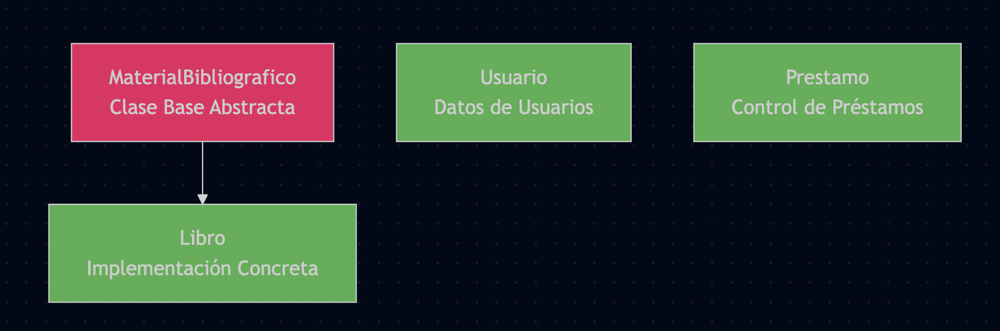
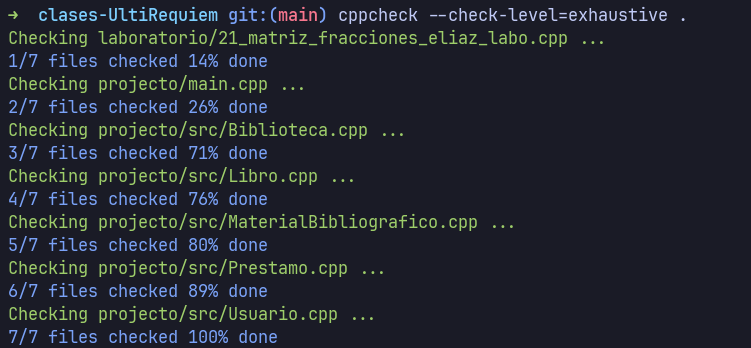
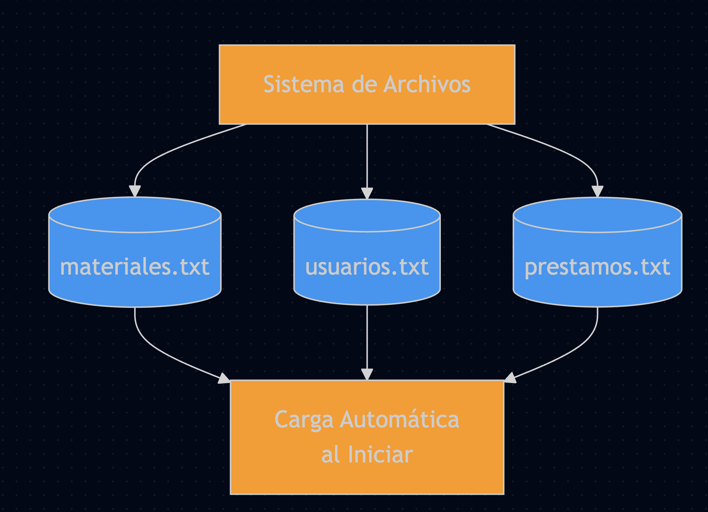
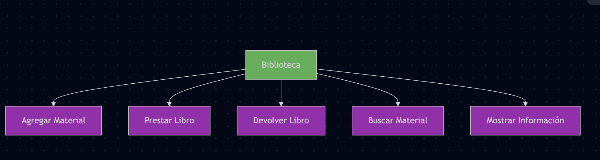

# Mi biblioteca

Projecto Final para el curso de Fundamentos de Programación con C++.

## Diagramas

Diagramas utiles para explicar

### Clases



### Flujo en archivos



### Persistencia de datos



### Operaciones



## Como ejecutar

1. hacemos make ( compila todo)

```sh
make
```

Otra alternativa:

```sh
make run
```

Esto compila y ejecuta el programa.

El delegado dijo que espere a que actualize el repositorio y que me saldria las
instruciones del repositorio, pero ya pasaron algunos dis y todavia no sale.
cppcheck lo podemos instalar en mac usando brew:

Voy a copiar las instruciones que enviaron al grupo y desarrollarlo aqui para ir
avanzando.

## Notas

### uso de headers guards

En nuestros archivos .h usamos header guars para evitar que se reincluyan varias veces.
Lo caul causa errores de compilacion

### Calidad de codigo

Usamos cppcheck para analisis estatico de nuestro codigo.

cppcheck lo podemos instalar en mac usando brew:

```sh
brew install cppcheck
```
